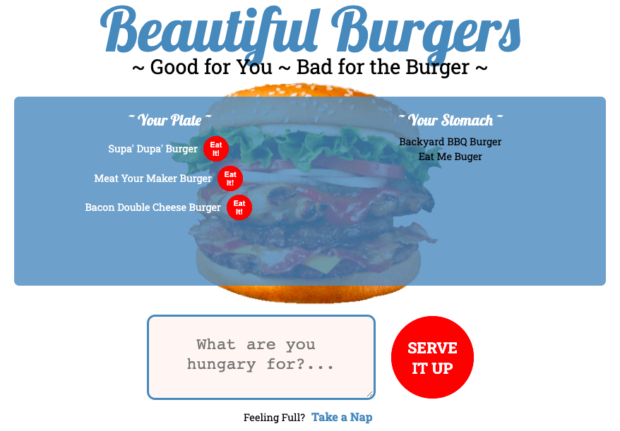

Beautiful Burgers
=============

## Description 
A fun, nonsensical game where the player can eat as many delicious burgers as they want without feeling bad. 
The goal of the project was to create an app with full CRUD features utilising MVC file architecture.

## Installation
Fork the repository, then navigate to the file in the terminal. 
then `npm install` to install the required packages.

## Usage 
 `npm start` to start from the terminal, otherwise you can find the app deployed [here.](https://quiet-bayou-27411.herokuapp.com/)

## Credits
I coded this project myself using node js, Express, mySQL and Handlebars modules. The Javascript is written with jQuery and all styling is with CSS.

You can find the repository [here](https://github.com/hkfernandez/Burger) and feel free to check out the rest of [my GitHub repository](https://github.com/hkfernandez).

## License
MIT

